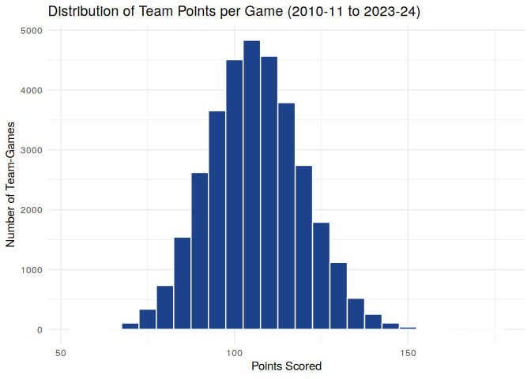
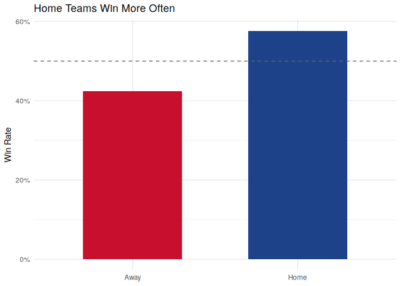
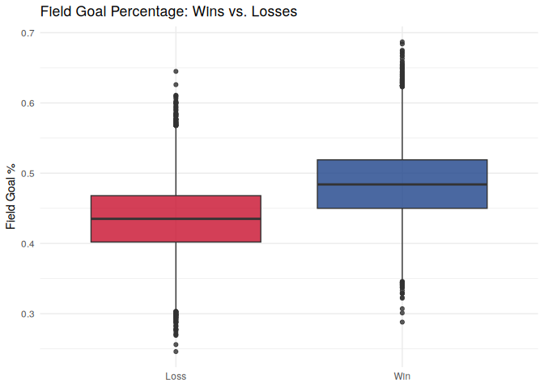
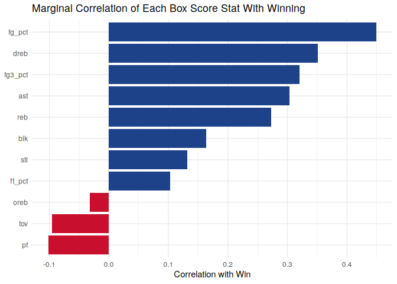
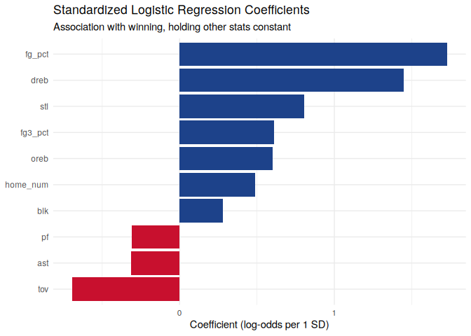

What Team Statistics Are Most Associated with Winning NBA Games?
================
David Lawlor
2026-07-10

``` r
library(dplyr)
library(tidyr)
library(readr)
library(stringr)
library(ggplot2)
library(knitr)
```

# Introduction

Winning an NBA game comes down to a lot of things, but a box score only
tracks a handful of them: shooting, rebounds, assists, turnovers,
steals, blocks, and fouls. We wanted to know which of these are actually
tied to winning the most.

Questions we’re looking to answer:

1.  Which team statistics have the strongest relationship with winning?
2.  Are rebounds, assists, or shooting percentages more important for
    success?
3.  Do winning teams commit fewer turnovers?
4.  Which statistics differ the most between winning and losing teams?

## Team Members

- David Lawlor

# Data

## Data Source

We used team level box scores from NBA regular season games, 2010-11
through 2023-24, pulled from a public dataset on GitHub
([`NocturneBear/NBA-Data-2010-2024`](https://github.com/NocturneBear/NBA-Data-2010-2024),
MIT licensed). Each game has two rows in the data, one for each team.

We saved the data as a CSV in `data/` instead of pulling it live with a
package like `hoopR`, so this report doesn’t depend on an API being up
when it knits.

``` r
nba_raw <- read_csv("data/regular_season_totals_2010_2024.csv",
                     show_col_types = FALSE)
dim(nba_raw)
```

    ## [1] 33316    57

## Data Cleaning

The raw file has a lot of columns we don’t need (rank columns for every
single stat). We kept the main identifying columns and box score stats,
made a numeric win column out of `WL`, and made a home/away column by
checking if `MATCHUP` has an `"@"` in it (away games look like
`"MIL @ MIA"`).

``` r
nba <- nba_raw %>%
  transmute(
    season    = SEASON_YEAR,
    team      = TEAM_NAME,
    game_id   = GAME_ID,
    game_date = as.Date(GAME_DATE),
    matchup   = MATCHUP,
    home      = !str_detect(MATCHUP, "@"),
    win       = as.integer(WL == "W"),
    fg_pct    = FG_PCT,
    fg3_pct   = FG3_PCT,
    ft_pct    = FT_PCT,
    oreb = OREB, dreb = DREB, reb = REB,
    ast = AST, tov = TOV, stl = STL, blk = BLK,
    pf  = PF,  pts = PTS
  ) %>%
  filter(!is.na(win))

# Any missing values left after cleaning?
colSums(is.na(nba))
```

    ##    season      team   game_id game_date   matchup      home       win    fg_pct 
    ##         0         0         0         0         0         0         0         0 
    ##   fg3_pct    ft_pct      oreb      dreb       reb       ast       tov       stl 
    ##         0         0         0         0         0         0         0         0 
    ##       blk        pf       pts 
    ##         0         0         0

No missing values left in the columns we use. One thing worth noting: a
few teams changed cities or names during this stretch (the Charlotte
Bobcats became the Hornets in 2014, for example), so `team` isn’t a
perfectly consistent identifier across all 14 seasons. That doesn’t
affect this analysis since we never group by team, but it would matter
for a team-level question.

## Marginal Summaries

``` r
glimpse(nba)
```

    ## Rows: 33,316
    ## Columns: 19
    ## $ season    <chr> "2022-23", "2020-21", "2013-14", "2013-14", "2018-19", "2012~
    ## $ team      <chr> "Golden State Warriors", "Milwaukee Bucks", "Brooklyn Nets",~
    ## $ game_id   <chr> "0022201230", "0022000051", "0021300359", "0021300347", "002~
    ## $ game_date <date> 2023-04-09, 2020-12-29, 2013-12-16, 2013-12-14, 2019-04-07,~
    ## $ matchup   <chr> "GSW @ POR", "MIL @ MIA", "BKN vs. PHI", "POR @ PHI", "HOU v~
    ## $ home      <lgl> FALSE, FALSE, TRUE, FALSE, TRUE, TRUE, TRUE, FALSE, TRUE, TR~
    ## $ win       <int> 1, 1, 1, 1, 1, 1, 1, 1, 1, 1, 1, 1, 1, 1, 1, 1, 1, 1, 1, 1, ~
    ## $ fg_pct    <dbl> 0.604, 0.554, 0.603, 0.559, 0.530, 0.505, 0.581, 0.500, 0.54~
    ## $ fg3_pct   <dbl> 0.551, 0.569, 0.600, 0.568, 0.474, 0.575, 0.636, 0.436, 0.59~
    ## $ ft_pct    <dbl> 0.875, 0.867, 0.577, 0.700, 0.762, 0.714, 0.714, 0.727, 0.66~
    ## $ oreb      <dbl> 9, 10, 4, 15, 12, 14, 12, 5, 9, 10, 12, 11, 5, 8, 8, 13, 9, ~
    ## $ dreb      <dbl> 49, 35, 38, 31, 40, 34, 40, 41, 37, 23, 32, 42, 37, 26, 26, ~
    ## $ reb       <dbl> 58, 45, 42, 46, 52, 48, 52, 46, 46, 33, 44, 53, 42, 34, 34, ~
    ## $ ast       <dbl> 47, 32, 35, 41, 34, 35, 34, 36, 39, 42, 31, 32, 35, 30, 37, ~
    ## $ tov       <dbl> 16, 17, 21, 19, 9, 9, 17, 15, 13, 13, 9, 24, 13, 13, 18, 18,~
    ## $ stl       <dbl> 13, 14, 10, 9, 12, 6, 8, 11, 8, 8, 7, 7, 8, 5, 9, 10, 10, 3,~
    ## $ blk       <dbl> 6, 2, 2, 8, 5, 2, 2, 10, 3, 6, 3, 9, 7, 2, 6, 6, 6, 3, 3, 5,~
    ## $ pf        <dbl> 18, 22, 20, 16, 16, 24, 25, 18, 21, 18, 26, 26, 21, 17, 23, ~
    ## $ pts       <dbl> 157, 144, 130, 139, 149, 140, 134, 124, 142, 130, 147, 135, ~

``` r
n_distinct(nba$game_id)
```

    ## [1] 16658

``` r
n_distinct(nba$season)
```

    ## [1] 14

``` r
n_distinct(nba$team)
```

    ## [1] 34

``` r
summary(nba %>% select(fg_pct, fg3_pct, reb, ast, tov, stl, blk, pts))
```

    ##      fg_pct          fg3_pct           reb             ast       
    ##  Min.   :0.2460   Min.   :0.000   Min.   :17.00   Min.   : 4.00  
    ##  1st Qu.:0.4220   1st Qu.:0.292   1st Qu.:39.00   1st Qu.:20.00  
    ##  Median :0.4590   Median :0.355   Median :43.00   Median :23.00  
    ##  Mean   :0.4604   Mean   :0.356   Mean   :43.44   Mean   :23.38  
    ##  3rd Qu.:0.5000   3rd Qu.:0.419   3rd Qu.:48.00   3rd Qu.:27.00  
    ##  Max.   :0.6870   Max.   :0.842   Max.   :81.00   Max.   :50.00  
    ##       tov            stl              blk              pts     
    ##  Min.   : 1.0   Min.   : 0.000   Min.   : 0.000   Min.   : 56  
    ##  1st Qu.:11.0   1st Qu.: 6.000   1st Qu.: 3.000   1st Qu.: 97  
    ##  Median :14.0   Median : 7.000   Median : 5.000   Median :106  
    ##  Mean   :14.2   Mean   : 7.624   Mean   : 4.879   Mean   :106  
    ##  3rd Qu.:17.0   3rd Qu.: 9.000   3rd Qu.: 6.000   3rd Qu.:115  
    ##  Max.   :31.0   Max.   :22.000   Max.   :20.000   Max.   :176

This is 14 seasons, 16,658 games, and 33316 team-game rows, split about
evenly between wins and losses since every game has one winner and one
loser.

## Points Distribution

``` r
ggplot(nba, aes(pts)) +
  geom_histogram(binwidth = 5, fill = "#1d428a", color = "white") +
  labs(
    title = "Distribution of Team Points per Game (2010-11 to 2023-24)",
    x = "Points Scored", y = "Number of Team-Games"
  ) +
  theme_minimal()
```

<!-- -->

Points per game are roughly bell shaped, centered a bit above 100, with
a few high scoring games pulling out a right tail.

# Analysis

## Home Court Advantage

Before getting into box score stats, we checked something simpler: does
playing at home matter?

``` r
home_summary <- nba %>%
  group_by(home) %>%
  summarise(win_rate = mean(win), games = n(), .groups = "drop") %>%
  mutate(location = ifelse(home, "Home", "Away"))

kable(home_summary %>% select(location, win_rate, games),
      digits = 3, col.names = c("Location", "Win Rate", "Games"),
      caption = "Win rate by home/away status")
```

| Location | Win Rate | Games |
|:---------|---------:|------:|
| Away     |    0.424 | 16658 |
| Home     |    0.576 | 16658 |

Win rate by home/away status

``` r
ggplot(home_summary, aes(x = location, y = win_rate, fill = location)) +
  geom_col(width = 0.6) +
  geom_hline(yintercept = 0.5, linetype = "dashed", color = "gray40") +
  scale_y_continuous(labels = scales::percent) +
  scale_fill_manual(values = c("Away" = "#c8102e", "Home" = "#1d428a")) +
  labs(title = "Home Teams Win More Often",
       x = NULL, y = "Win Rate") +
  theme_minimal() +
  theme(legend.position = "none")
```

<!-- -->

Home teams won about 57.6% of games, compared to 42.4% for away teams.
That’s not really a “stat” a team controls in the moment, so we added
home/away as a control in the regression later on.

## Win vs. Loss Averages

``` r
summary_tbl <- nba %>%
  mutate(result = ifelse(win == 1, "Win", "Loss")) %>%
  group_by(result) %>%
  summarise(
    `FG%` = mean(fg_pct), `3P%` = mean(fg3_pct), `FT%` = mean(ft_pct),
    Reb = mean(reb), Ast = mean(ast), TOV = mean(tov),
    Stl = mean(stl), Blk = mean(blk), PF = mean(pf),
    .groups = "drop"
  )

kable(summary_tbl, digits = 3, caption = "Average box score stats: wins vs. losses")
```

| result |   FG% |   3P% |   FT% |    Reb |    Ast |    TOV |   Stl |   Blk |     PF |
|:-------|------:|------:|------:|-------:|-------:|-------:|------:|------:|-------:|
| Loss   | 0.435 | 0.325 | 0.756 | 41.642 | 21.784 | 14.577 | 7.242 | 4.465 | 20.470 |
| Win    | 0.485 | 0.387 | 0.777 | 45.246 | 24.984 | 13.827 | 8.006 | 5.293 | 19.594 |

Average box score stats: wins vs. losses

Winning teams shoot better, grab more rebounds, get more assists and
steals, and turn the ball over less. None of that is shocking. The real
question is how much each one matters, and whether some of these numbers
are just tied to each other.

``` r
ggplot(nba, aes(x = factor(win, labels = c("Loss", "Win")), y = fg_pct,
                 fill = factor(win, labels = c("Loss", "Win")))) +
  geom_boxplot(alpha = 0.8) +
  scale_fill_manual(values = c("Loss" = "#c8102e", "Win" = "#1d428a")) +
  labs(title = "Field Goal Percentage: Wins vs. Losses",
       x = NULL, y = "Field Goal %") +
  theme_minimal() +
  theme(legend.position = "none")
```

<!-- -->

## Which Stats Correlate With Winning

``` r
vars <- c("fg_pct", "fg3_pct", "ft_pct", "oreb", "dreb", "reb",
          "ast", "tov", "stl", "blk", "pf")

marginal_cor <- tibble(
  stat = vars,
  correlation = sapply(vars, function(v) cor(nba[[v]], nba$win))
) %>%
  arrange(desc(correlation))

kable(marginal_cor, digits = 3,
      caption = "Correlation of each stat with winning, one at a time")
```

| stat    | correlation |
|:--------|------------:|
| fg_pct  |       0.449 |
| dreb    |       0.351 |
| fg3_pct |       0.321 |
| ast     |       0.304 |
| reb     |       0.273 |
| blk     |       0.163 |
| stl     |       0.132 |
| ft_pct  |       0.103 |
| oreb    |      -0.032 |
| tov     |      -0.096 |
| pf      |      -0.102 |

Correlation of each stat with winning, one at a time

``` r
ggplot(marginal_cor, aes(x = reorder(stat, correlation), y = correlation,
                          fill = correlation > 0)) +
  geom_col() +
  coord_flip() +
  scale_fill_manual(values = c("TRUE" = "#1d428a", "FALSE" = "#c8102e"), guide = "none") +
  labs(title = "Marginal Correlation of Each Box Score Stat With Winning",
       x = NULL, y = "Correlation with Win") +
  theme_minimal()
```

<!-- -->

Field goal %, defensive rebounds, three point %, and assists have the
strongest positive correlation with winning. Turnovers and fouls are the
only negative ones. Offensive rebounds barely correlate at all, which is
a little surprising since extra possessions should help.

## Are These Stats Actually Independent?

These stats aren’t independent of each other. An assist can only happen
after a made shot, so assists and field goal % should move together for
reasons that have nothing to do with winning specifically. To check this
properly, we ran a logistic regression predicting wins from all the
stats at once, which controls for that overlap instead of looking at
each stat alone.

``` r
predictors <- c("fg_pct", "fg3_pct", "oreb", "dreb", "ast", "tov", "stl", "blk", "pf")
cor_matrix <- cor(nba[, predictors])
diag(cor_matrix) <- NA

cat("Strongest correlation between two predictors:",
    round(max(abs(cor_matrix), na.rm = TRUE), 3),
    "(assists and field goal %)\n")
```

    ## Strongest correlation between two predictors: 0.559 (assists and field goal %)

``` r
nba_scaled <- nba %>%
  mutate(across(all_of(predictors), ~ as.numeric(scale(.)))) %>%
  mutate(home_num = as.integer(home))

fit <- glm(
  win ~ fg_pct + fg3_pct + oreb + dreb + ast + tov + stl + blk + pf + home_num,
  data = nba_scaled, family = binomial()
)

summary(fit)
```

    ## 
    ## Call:
    ## glm(formula = win ~ fg_pct + fg3_pct + oreb + dreb + ast + tov + 
    ##     stl + blk + pf + home_num, family = binomial(), data = nba_scaled)
    ## 
    ## Coefficients:
    ##             Estimate Std. Error z value Pr(>|z|)    
    ## (Intercept) -0.22776    0.02158  -10.55   <2e-16 ***
    ## fg_pct       1.72876    0.02599   66.53   <2e-16 ***
    ## fg3_pct      0.60989    0.01855   32.87   <2e-16 ***
    ## oreb         0.60350    0.01723   35.03   <2e-16 ***
    ## dreb         1.44730    0.02067   70.01   <2e-16 ***
    ## ast         -0.31352    0.01937  -16.19   <2e-16 ***
    ## tov         -0.69559    0.01707  -40.75   <2e-16 ***
    ## stl          0.80416    0.01733   46.40   <2e-16 ***
    ## blk          0.28132    0.01575   17.86   <2e-16 ***
    ## pf          -0.30676    0.01572  -19.52   <2e-16 ***
    ## home_num     0.48728    0.03060   15.92   <2e-16 ***
    ## ---
    ## Signif. codes:  0 '***' 0.001 '**' 0.01 '*' 0.05 '.' 0.1 ' ' 1
    ## 
    ## (Dispersion parameter for binomial family taken to be 1)
    ## 
    ##     Null deviance: 46186  on 33315  degrees of freedom
    ## Residual deviance: 26897  on 33305  degrees of freedom
    ## AIC: 26919
    ## 
    ## Number of Fisher Scoring iterations: 5

``` r
mcfadden_r2 <- 1 - fit$deviance / fit$null.deviance
cat("McFadden pseudo R-squared:", round(mcfadden_r2, 3), "\n")
```

    ## McFadden pseudo R-squared: 0.418

``` r
coef_tbl <- tibble(
  stat = names(coef(fit))[-1],
  estimate = coef(fit)[-1]
) %>%
  arrange(desc(estimate))

ggplot(coef_tbl, aes(x = reorder(stat, estimate), y = estimate,
                      fill = estimate > 0)) +
  geom_col() +
  coord_flip() +
  scale_fill_manual(values = c("TRUE" = "#1d428a", "FALSE" = "#c8102e"), guide = "none") +
  labs(title = "Standardized Logistic Regression Coefficients",
       subtitle = "Association with winning, holding other stats constant",
       x = NULL, y = "Coefficient (log-odds per 1 SD)") +
  theme_minimal()
```

<!-- -->

Once we control for everything else, assists flips from a strong
positive correlation to a small negative coefficient, since its positive
effect was mostly just riding along with field goal %. FG% and defensive
rebounds stay the strongest positive predictors, and turnovers stay
negative. The model’s McFadden pseudo R-squared is about 0.42, so these
stats explain a good chunk of who wins, but not all of it. Also worth
keeping in mind: this shows what’s associated with winning, not what
happened before tip-off or what causes what.

# Conclusions

Going back to our original questions:

1.  **Which team statistics have the strongest relationship with
    winning?** Field goal % and defensive rebounds, both alone and after
    controlling for everything else. Turnovers and fouls are the only
    stats that are consistently negative.

2.  **Are rebounds, assists, or shooting percentages more important?**
    Shooting percentage matters most, along with defensive rebounding.
    Assists look important alone, but most of that effect turns out to
    just be shooting percentage in disguise.

3.  **Do winning teams commit fewer turnovers?** Yes. Winning teams
    average 13.8 turnovers a game compared to 14.6 for losing teams, and
    turnovers stay negative even after controlling for every other stat.

4.  **Which statistics differ the most between winning and losing
    teams?** Field goal % and defensive rebounds show the biggest, most
    consistent gap. Offensive rebounds were the biggest surprise: no
    real correlation alone, but a real positive effect once shooting
    percentage is held constant, probably because offensive rebounds are
    more available after a missed shot in the first place.

Overall this backs up a pretty intuitive story: shoot well, control the
defensive glass, take care of the ball. But we only got there by
checking that these correlations weren’t just riding on each other.

# Reproducibility

This report reads `data/regular_season_totals_2010_2024.csv` straight
from this repo, so it knits without needing internet access. It only
uses tidyverse packages from class (`dplyr`, `tidyr`, `readr`,
`stringr`, `ggplot2`, `knitr`).

``` r
sessionInfo()
```

    ## R version 4.3.3 (2024-02-29)
    ## Platform: x86_64-pc-linux-gnu (64-bit)
    ## Running under: Ubuntu 24.04.4 LTS
    ## 
    ## Matrix products: default
    ## BLAS:   /usr/lib/x86_64-linux-gnu/blas/libblas.so.3.12.0 
    ## LAPACK: /usr/lib/x86_64-linux-gnu/lapack/liblapack.so.3.12.0
    ## 
    ## locale:
    ## [1] C
    ## 
    ## time zone: Etc/UTC
    ## tzcode source: system (glibc)
    ## 
    ## attached base packages:
    ## [1] stats     graphics  grDevices utils     datasets  methods   base     
    ## 
    ## other attached packages:
    ## [1] knitr_1.45    ggplot2_3.4.4 stringr_1.5.1 readr_2.1.5   tidyr_1.3.1  
    ## [6] dplyr_1.1.4  
    ## 
    ## loaded via a namespace (and not attached):
    ##  [1] bit_4.0.5        gtable_0.3.4     highr_0.10       crayon_1.5.2    
    ##  [5] compiler_4.3.3   tidyselect_1.2.0 parallel_4.3.3   scales_1.3.0    
    ##  [9] yaml_2.3.8       fastmap_1.1.1    R6_2.5.1         labeling_0.4.3  
    ## [13] generics_0.1.3   tibble_3.2.1     munsell_0.5.0    pillar_1.9.0    
    ## [17] tzdb_0.4.0       rlang_1.1.3      utf8_1.2.4       stringi_1.8.3   
    ## [21] xfun_0.41        bit64_4.0.5      cli_3.6.2        withr_2.5.0     
    ## [25] magrittr_2.0.3   digest_0.6.34    grid_4.3.3       vroom_1.6.5     
    ## [29] hms_1.1.3        lifecycle_1.0.4  vctrs_0.6.5      evaluate_0.23   
    ## [33] glue_1.7.0       farver_2.1.1     fansi_1.0.5      colorspace_2.1-0
    ## [37] rmarkdown_2.25   purrr_1.0.2      tools_4.3.3      pkgconfig_2.0.3 
    ## [41] htmltools_0.5.7
